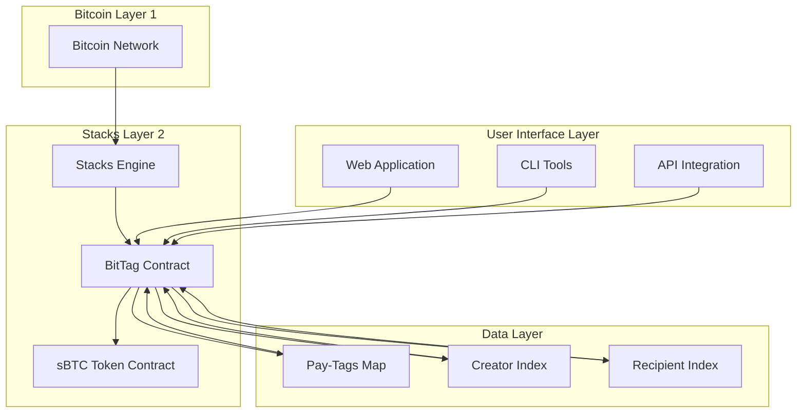
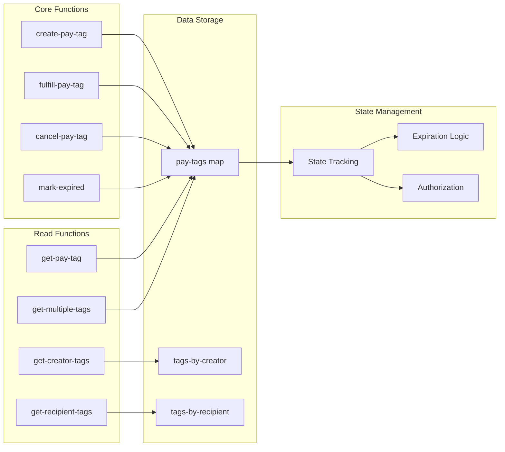
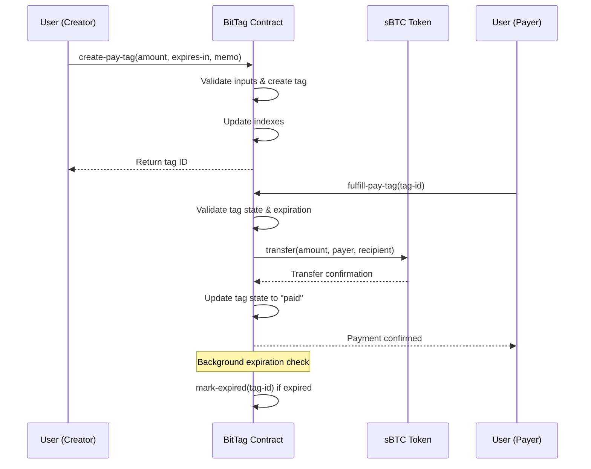

# BitTag - Bitcoin Payment Request Protocol

[](https://stacks.co)
[](https://bitcoin.org)

**BitTag** is a decentralized payment tagging system for Bitcoin Layer 2 transactions, built on the Stacks blockchain. It enables users to create secure, time-bound payment requests using sBTC (Synthetic Bitcoin), making it perfect for invoicing, bill splitting, and peer-to-peer payments with built-in expiration mechanics and comprehensive state management.

## 🚀 Features

- **Decentralized Payment Requests**: Create payment tags without intermediaries
- **Time-Bound Expiration**: Built-in expiration mechanics (max 30 days)
- **Bitcoin Native**: Leverages sBTC for seamless Bitcoin Layer 2 transactions
- **State Management**: Comprehensive tracking of payment states (pending, paid, expired, canceled)
- **Multi-Index System**: Efficient lookups by creator and recipient
- **Batch Operations**: Optimized for UI applications with batch retrieval
- **Event Logging**: Complete audit trail with structured events
- **Security First**: Input validation and authorization controls

## 🏗️ Architecture

### System Overview



### Contract Architecture



### Data Flow



## 📋 Prerequisites

- **Stacks Wallet**: For transaction signing and account management
- **sBTC Balance**: Sufficient sBTC tokens for payment fulfillment
- **Stacks Node Access**: Connection to Stacks blockchain network

## 🛠️ Installation & Deployment

### Deploy Contract

```bash
# Using Clarinet CLI
clarinet deploy --network testnet

# Or using Stacks CLI
stx deploy_contract bittag bittag.clar --network testnet
```

### Integration

```javascript
// JavaScript/TypeScript integration example
import { StacksNetwork, makeContractCall } from '@stacks/transactions';

const network = new StacksNetwork();
const contractAddress = 'ST1F7QA2MDF17S807EPA36TSS8AMEFY4KA9TVGWXT';
const contractName = 'bittag';

// Create a payment tag
const createPayTag = async (amount, expiresIn, memo) => {
  return makeContractCall({
    network,
    anchorMode: 'any',
    contractAddress,
    contractName,
    functionName: 'create-pay-tag',
    functionArgs: [
      uintCV(amount),
      uintCV(expiresIn),
      someCV(stringAsciiCV(memo))
    ]
  });
};
```

## 🔄 Core Functions

### Creating Payment Tags

```clarity
;; Create a new payment request
(create-pay-tag amount expires-in memo)
```

**Parameters:**

- `amount` (uint): Payment amount in sBTC units
- `expires-in` (uint): Expiration time in blocks from creation
- `memo` (optional string): Description or note (max 256 chars)

**Returns:** Unique tag ID

### Fulfilling Payments

```clarity
;; Pay an existing tag
(fulfill-pay-tag tag-id)
```

**Parameters:**

- `tag-id` (uint): Unique identifier of the payment tag

**Returns:** Tag ID confirmation

### Managing Tags

```clarity
;; Cancel a pending tag (creator only)
(cancel-pay-tag tag-id)

;; Mark expired tags (anyone can call)
(mark-expired tag-id)
```

## 📊 State Management

### Payment States

| State | Description | Transitions |
|-------|-------------|-------------|
| `pending` | Awaiting payment | → `paid`, `expired`, `canceled` |
| `paid` | Successfully fulfilled | Final state |
| `expired` | Time limit exceeded | Final state |
| `canceled` | Canceled by creator | Final state |

### State Transition Rules

- Only pending tags can be paid or canceled
- Only creators can cancel their own tags
- Anyone can mark expired tags as expired
- Expired tags cannot be paid

## 🔍 Query Functions

### Retrieve Tag Information

```clarity
;; Get specific tag details
(get-pay-tag tag-id)

;; Get all tags created by a user
(get-creator-tags creator-principal)

;; Get all tags where user is recipient
(get-recipient-tags recipient-principal)

;; Batch retrieve multiple tags
(get-multiple-tags (list tag-id-1 tag-id-2 ...))
```

## 🛡️ Security Features

### Input Validation

- Amount bounds checking (1 to max uint)
- Expiration limits (max 30 days)
- Memo length validation (max 256 characters)
- ID validation for all operations

### Authorization Controls

- Creator-only cancellation rights
- State-based operation restrictions
- Expiration enforcement

### Error Handling

Comprehensive error constants for all failure scenarios:

- `ERR-TAG-EXISTS` (100): Tag already exists
- `ERR-NOT-PENDING` (101): Tag not in pending state
- `ERR-INSUFFICIENT-FUNDS` (102): Insufficient sBTC balance
- `ERR-NOT-FOUND` (103): Tag not found
- `ERR-UNAUTHORIZED` (104): Operation not authorized
- `ERR-EXPIRED` (105): Tag has expired
- `ERR-INVALID-AMOUNT` (106): Invalid payment amount
- `ERR-EMPTY-MEMO` (107): Empty memo provided
- `ERR-MAX-EXPIRATION-EXCEEDED` (108): Expiration too long

## 📈 Performance Optimizations

### Indexing Strategy

- **Creator Index**: Fast lookup of tags by creator
- **Recipient Index**: Fast lookup of tags by recipient
- **Batch Operations**: Reduced RPC calls for UI applications

### Storage Efficiency

- Compact data structures
- Optional fields for memory optimization
- Bounded list sizes (max 50 tags per index)

## 🧪 Testing

### Unit Tests

```bash
clarinet test
```

### Integration Testing

```javascript
// Example test case
describe('BitTag Contract', () => {
  it('should create and fulfill payment tag', async () => {
    const tagId = await createPayTag(1000, 100, 'Test payment');
    const result = await fulfillPayTag(tagId);
    expect(result).toBe(tagId);
  });
});
```

## 🚀 Use Cases

### 1. **E-commerce Invoicing**

Create time-bound payment requests for goods and services with automatic expiration.

### 2. **Bill Splitting**

Generate payment tags for shared expenses among friends or colleagues.

### 3. **Subscription Payments**

Recurring payment requests with built-in expiration for subscription services.

### 4. **Freelancer Payments**

Professional invoicing system with memo fields for project descriptions.

### 5. **Peer-to-Peer Lending**

Secure payment requests with clear terms and automatic expiration.

## 🔮 Roadmap

- [ ] **v2.0**: Multi-token support beyond sBTC
- [ ] **v2.1**: Recurring payment tags
- [ ] **v2.2**: Partial payment support
- [ ] **v2.3**: Payment splitting functionality
- [ ] **v3.0**: Cross-chain payment requests

## 🤝 Contributing

We welcome contributions! Please see our [Contributing Guidelines](CONTRIBUTING.md) for details.

### Development Setup

```bash
git clone https://github.com/johnfridayh8/BitTag.git
cd bit-tag
clarinet install
clarinet test
```

## 🙏 Acknowledgments

- **Stacks Foundation** for the Layer 2 infrastructure
- **Bitcoin Core** for the underlying security model
- **Community Contributors** for feedback and improvements

---

### Built with ❤️ on Bitcoin Layer 2
